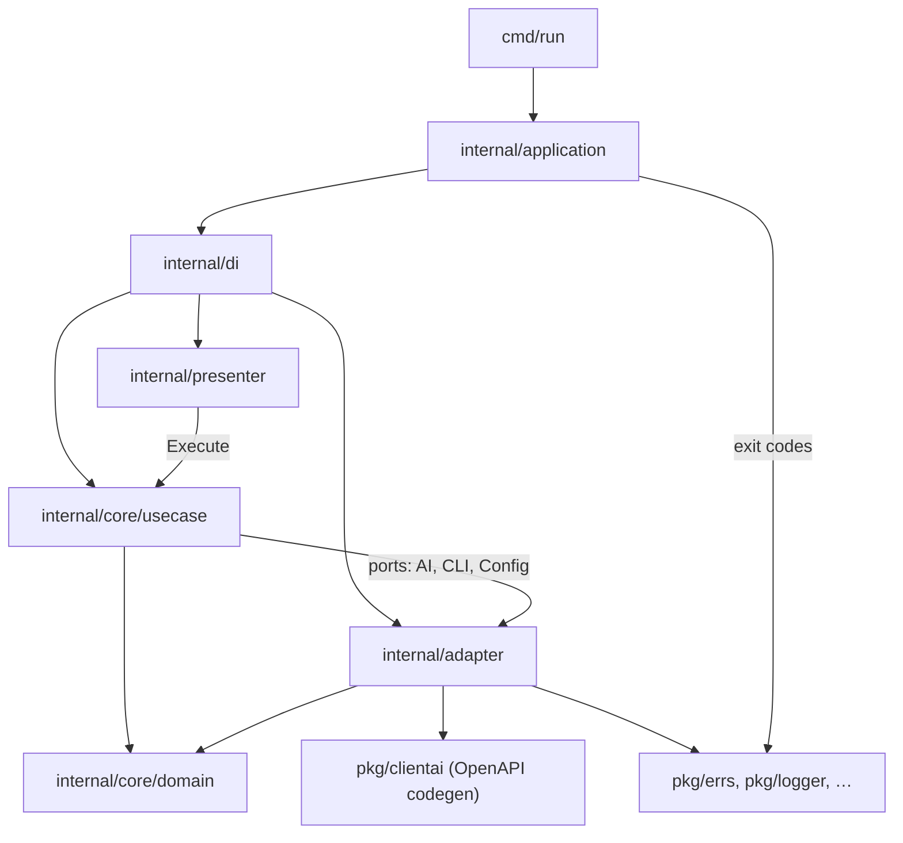
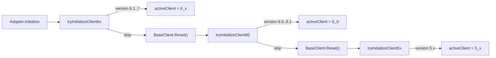

# aictl — Architecture Guide for Agents

**aictl** (Application Inspector ConTroL) — CLI для управления PT Application Inspector. Проект построен на **hexagonal architecture** с ручным DI. Архитектурные границы проверяются `go-arch-lint check` по всему репозиторию (`.go-arch-lint.yml`, `workdir: .`).

## Слои и поток данных



Типичный путь команды:

1. `cmd/run/main.go` — signal context, `application.NewApplication()`, `Run()`.
2. `internal/application/application.go` — загрузка context config, `di.InitializeCmd()`, cobra `ExecuteContext`, маппинг exit code.
3. `internal/presenter/*` — cobra-команды: флаги, `PersistentPreRunE` (logger, overlay флагов на config), вызов use case.
4. `internal/core/usecase/*` — бизнес-логика; зависит только от **локальных port-интерфейсов** и domain.
5. `internal/adapter/*` — реализация портов: HTTP к AI-серверу, YAML context, stdout/stderr.

Presenter **не** импортирует adapter напрямую — только use case через интерфейс в конструкторе cobra-команды.

## Структура каталогов

| Путь                                                          | Назначение                                                                        |
|---------------------------------------------------------------|-----------------------------------------------------------------------------------|
| `cmd/run/`                                                    | Точка входа                                                                       |
| `cmd/doc/`                                                    | Генерация markdown-документации команд                                            |
| `internal/application/`                                       | Composition root: bootstrap, exit codes                                           |
| `internal/di/`                                                | Ручной wiring: adapters → use cases → presenters                                  |
| `internal/presenter/`                                         | Cobra CLI, grouped: `context`, `create`, `delete`, `get`, `scan`, `set`, `update` |
| `internal/core/usecase/`                                      | Use cases (по одному пакету на команду/сценарий)                                  |
| `internal/core/domain/`                                       | Domain models, validation, без зависимостей от `pkg/`                             |
| `internal/adapter/ai/`                                        | Фасад AI + версионирование 5.4 / 6.0 / 6.1+                                       |
| `internal/adapter/ai/{5_4,6_0,6_4}/`                          | Маппинг domain ↔ OpenAPI types                                                    |
| `internal/adapter/ai/client/`                                 | BaseClient, retry, JWT helpers                                                    |
| `internal/adapter/cli/`                                       | Вывод в терминал, подтверждения                                                   |
| `internal/adapter/config/`                                    | Чтение/запись `context.yaml`                                                      |
| `pkg/clientai/{5_4,6_0,6_4}/`                                 | **Только** OpenAPI codegen (`backend.gen.go`, `swagger.yaml`)                     |
| `pkg/errs/`                                                   | Сетевые/API ошибки и их exit codes                                                |
| `pkg/logger/`, `pkg/fshelper/`, `pkg/version/`, `pkg/metric/` | Утилиты без зависимостей от `internal/`                                           |

## Правила зависимостей (go-arch-lint)

Компоненты и разрешённые зависимости:

| Компонент | Может зависеть от |
|-----------|-------------------|
| `domain` | только `domain` |
| `core` (use cases) | `core`, `domain`, `pkg_lib` |
| `presenter` | `core`, `presenter`, `domain`, `pkg_lib` |
| `adapter` | `adapter`, `domain`, `pkg_clientai`, `pkg_lib` |
| `di` | всё внутри `internal/` + `pkg_*` |
| `application` | `adapter`, `application`, `core`, `di`, `presenter`, `domain`, `pkg_lib` |
| `cmd` | `application`, `pkg_lib` |
| `pkg_clientai` | только `pkg_clientai` |
| `pkg_lib` | только `pkg_lib` |

**Критично для агентов:**

- Use cases и domain **не импортируют** `pkg/clientai` — маппинг API только в `internal/adapter/ai/`.
- `pkg/` не импортирует `internal/`.
- Validation errors живут в `internal/core/domain/validation/`; domain не зависит от `pkg/errs`.

Перед PR: `go-arch-lint check`, `golangci-lint run`, `go test ./...`.

## Ports (интерфейсы use case)

Каждый use case объявляет **свои** минимальные интерфейсы `AI`, `CLI`, иногда `Config` — это осознанный ISP (Interface Segregation). Mockery генерирует моки в `usecase/*/mocks/`.

Пример (`get/healthcheck`):

```go
type AI interface {
    InitializeWithRetry(ctx context.Context) error
    GetHealthcheck(ctx context.Context) (bool, error)
}
type CLI interface {
    ReturnText(ctx context.Context, text string)
}
```

`internal/adapter/ai.Adapter` реализует монолитный `ClientAi` (~25 методов) и делегирует в `activeClient` (5.x, 6.0 или 6.1+). Формальной связи между `ClientAi` и портами use case **нет** — compile-time проверка только через DI.

### Initialize vs InitializeWithRetry

| Метод | Поведение |
|-------|-----------|
| `Initialize` | Выбор 5.x / 6.0 / 6.1+ клиента, проверка версии и лицензии |
| `InitializeWithRetry` | `Initialize` + `AddJwtRetry()` на активном клиенте |

**Несогласованность:** большинство use cases вызывают `InitializeWithRetry`; `create/branch` и `update/sources` — только `Initialize` (без JWT retry). При добавлении команд — следовать окружающим use cases той же группы или унифицировать на `InitializeWithRetry`.

## AI adapter: версионирование 5.x / 6.0 / 6.1+



- Поддерживаемый диапазон версий сервера: **5.0.0 ≤ ver < 7.0.0** (`adapter.go`, `init.go`).
- Порядок попыток: **6.1+** (`6_x`) → **6.0.x** (`6_0`) → **5.x** (`5_x`). При несовпадении версии — `BaseClient.Reset()` и следующая попытка.
- Границы: `6_0` для `[6.0.0, 6.1.0)`, `6_x` для `[6.1.0, 7.0.0)`.
- Все клиенты делят один `client.BaseClient` (JWT, HTTP clients). **Параллельное использование двух клиентов невозможно** — shared mutable state.
- Ручной код маппинга: `internal/adapter/ai/{5_x,6_0,6_x}/client.go` (~1000 строк каждый, значительное дублирование).
- Codegen: `pkg/clientai/{5_x,6_0,6_x}/` — перегенерация через `go generate` в `gen.go`.

При правках scan/settings/report — проверять **все три** адаптера или выносить shared helpers в `internal/adapter/ai/client/` или новый shared-пакет внутри `adapter/ai/`.

## DI (composition root)

`internal/di/container.go` — точка сборки; wiring разбит по файлам:

- `adapters.go` — `config.Adapter`, `cli.Adapter`, `ai.Adapter`
- `context.go`, `create.go`, `delete.go`, `get.go`, `scan.go`, `set.go`, `update.go` — use case → presenter

Паттерн в каждом `build*Cmd`:

```go
uc, err := someUseCase.NewUseCase(a.ai, a.cli, a.cfg)
cmd := presenter.NewSomeCmd(uc)
```

**Дублирование bootstrap:** `application.NewApplication()` загружает config через `adapter/config` до DI; в `di/adapters.go` создаётся ещё один `configAdapter` для context-команд. Это известный нюанс — не объединять без явной задачи.

## Config и context

- Domain model: `internal/core/domain/config/` — URI, token, TLS skip, project/branch UUID.
- Persistence: `~/.config/aictl/context.yaml` (через `adapter/config`).
- CLI overlay: глобальные флаги `-u/--uri`, `-t/--token`, `--tls-skip` на connection-командах через `presenter/.utils/cmd.go` → `UpdateConnectionConfig` + `cfg.Validate()`.
- Ошибки чтения `context.yaml` сейчас **молча** возвращают пустой config (TODO: logging).

## Обработка ошибок и exit codes

Два места маппинга (намеренное разделение слоёв):

| Слой | Файл | Exit code |
|------|------|-----------|
| Validation (`domain/validation`) | `internal/application/exitcode.go` | **1** |
| Сетевые/API (`pkg/errs`) | `pkg/errs/utils.go` | **1** (nil response), **2** (auth, 4xx, 5xx, not found), **-1** (unknown) |

Use cases оборачивают ошибки через `fmt.Errorf("…: %w", err)` — для `errors.As` в мапперах важно сохранять цепочку `%w`.

Validation types: `Error`, `FieldError`, `RequiredError`, `InvalidError`.

## Presenter conventions

- Каждая команда: struct с `*cobra.Command`, конструктор `New*Cmd(useCase)`.
- Use case передаётся как **локальный интерфейс** с методом `Execute(ctx, …)`.
- Connection-команды: `_utils.AddConnectionPersistentFlags`, `_utils.ChainRunE(_utils.UpdateConfig(cfg), …)`.
- Root: `PersistentPreRunE: _utils.InitializeLogger` — logger в context (`pkg/logger`).
- При ошибке use case: `cmd.SilenceUsage = true`, wrap с именем команды.

## Незавершённый функционал

Команды доступны в CLI, но use case содержит `panic("not implemented")`:

- `internal/core/usecase/get/scan/result/result.go`
- `internal/core/usecase/update/sources/git/git.go`

Не подключать к production-сценариям без реализации; при работе с этими командами — реализовать или скрыть из CLI.

## Тестирование

Покрытие минимальное (4 test-файла на ~190 hand-written Go в `internal/`):

- `internal/adapter/ai/client/retry_test.go`
- `internal/adapter/ai/client_test.go` — `validateVersion`, `isClient60Version`, `isClient6xVersion`
- `internal/core/usecase/get/scan/report/defaultreport/default_report_test.go`
- `internal/core/usecase/set/project/settings/settings_test.go`

Mockery-моки (~48 файлов) сгенерированы, но почти не используются. При добавлении тестов — приоритет: init flow 6.1+→6.0→5x, exit code mapping, critical use cases.

## Рекомендации при изменениях

1. **Новая команда:** domain (если нужны типы) → use case с локальными ports → presenter cobra → wiring в `internal/di/*.go`.
2. **Новый AI-метод:** добавить в `ClientAi` + `Adapter` delegate → реализовать в **трёх** `5_x/client.go`, `6_0/client.go` и `6_x/client.go` → добавить в port нужных use cases.
3. **OpenAPI изменился:** обновить `swagger.yaml`, `go generate` в `pkg/clientai/{5_x,6_0,6_x}/`, затем adapter mapping.
4. **Не нарушать arch-lint:** use case не должен импортировать adapter или `pkg/clientai`.
5. **Shared logic 5x/6.0/6.1+:** выносить в `internal/adapter/ai/client/` или internal shared helper — главный источник регрессий при дублировании.
6. **Exit codes:** validation → `exitcode.go`; network/API → `pkg/errs`.

## CI

GitHub Actions: `arch-lint`, `golangci-lint`, `test`, `check-doc` (генерация `doc/aictl.md`).

## Документация для пользователей

- `doc/aictl.md` — справочник команд (генерируется)
- `doc/migration/` — миграция с aisa / ptai-cli-plugin
